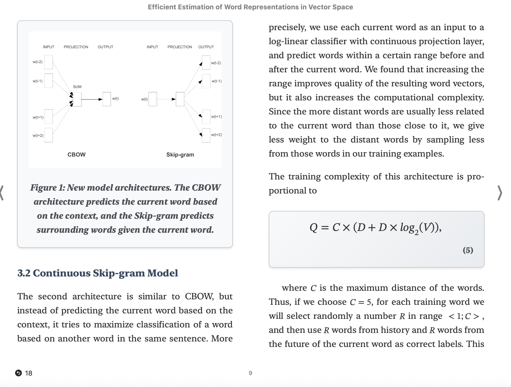

# LaTeX to ePub Converter

Convert LaTeX academic papers to high-quality ePub format so you can read them on a mobile device. Uses LaTeXML processing with AI-enhanced bibliography formatting.


## 🚀 **Quick Start**

```bash
# Install dependencies
pip install -r requirements.txt

# Convert LaTeX to ePub (two-step process)
python3 latex_to_xml.py path/to/paper.tex
python3 xml_to_epub.py output/paper.xml

# Output: epub_books/paper.epub
```

## 📋 **Requirements**

### System Dependencies
```bash
# LaTeXML (Ubuntu/Debian)
sudo apt-get install latexml

# LaTeXML (macOS)
brew install latexml

# AWS CLI for cognitive processing
aws configure
```

### Python Dependencies
```bash
pip install -r requirements.txt
```

## 🎯 **Production Architecture**

```
LaTeX Source → LaTeX Expansion → LaTeXML → Cognitive Enhancement → XSLT → Professional ePub
```

### **Core Files**
- `latex_to_xml.py` - LaTeXML + Bedrock cognitive converter
- `xml_to_epub.py` - XSLT-based ePub generator
- `xml_to_epub.xsl` - High quality LaTeXML stylesheet
- `review_structure.py` - Quality assessment module

## ✨ **Features**

### **Professional-Quality LaTeX Processing**
- ✅ **Multi-file support** - Automatic `\input{}`/`\include{}` expansion
- ✅ **Industry-standard conversion** - LaTeXML engine with MathML
- ✅ **Excellent table rendering** - Complex academic tables preserved
- ✅ **Image handling** - Automatic figure processing and embedding

### **AI-Enhanced Bibliography**
- ✅ **Cognitive processing** - Amazon Bedrock Claude Sonnet handles complex, variables formats
- ✅ **Smart citation formatting** - Converts to `[AuthorYear]` format
- ✅ **Full author preservation** - Complete citation details
- ✅ **Clean text flow** - Flattened citations, no line breaks

### **Quality Assurance**
- ✅ **LaTeX cleanup** - Removes artifacts like `\xspace`
- ✅ **Comprehensive assessment** - LaTeXML-adapted quality scoring
- ✅ **Professional output** - Mobile-compatible ePub format
- ✅ **Validation** - Schema-compliant XML generation

## 🔧 **Advanced Usage**

### Directory Processing
```bash
# Automatically detects main LaTeX file
python3 latex_to_xml.py path/to/latex/directory/
```

### Quality Assessment
The converter provides detailed quality metrics:
- **Metadata preservation** (title, authors, abstract)
- **Structure conversion** (sections, equations, tables, figures)  
- **Bibliography processing** (citation formatting, reference completeness)
- **LaTeXML quality indicators** (XML structure, namespacing, content preservation)

### Caching
- **LaTeX expansion** - Cached with timestamp validation
- **Bedrock calls** - Automatic response caching for efficiency

## 📁 **Project Structure**

```
~/workspace/
├── latex_to_xml.py              # Main LaTeX converter
├── xml_to_epub.py               # ePub generator
├── xml_to_epub.xsl              # XSLT stylesheet
├── review_structure.py          # Quality assessment
├── requirements.txt             # Dependencies
├── output/                      # Generated XML files
├── epub_books/                  # Generated ePub files
└── approaches/                  # Historical development (see below)
```

## 📚 **Historical Development**

The `approaches/` directory contains the research and development history of this converter:

### **approaches/xml_to_epub/**
- `latex_to_xml_rules_based.py` - Pure Python regex-based parsing
- `latex_to_xml_cognitive.py` - Amazon Q Developer CLI approach  
- `latex_to_xml_hybrid.py` - TexSoup + pylatexenc + LLM combination
- `latex_to_xml_latexml.py` - Original LaTeXML implementation
- `xml_to_epub_latexml.py` - Original ePub generator
- `structural_review/` - Quality assessment framework
- `tools/` - Development utilities and testing tools

### **Evolution Summary**
1. **Rules-Based** (99.8% quality) - Reliable but limited LaTeX cleaning
2. **Cognitive** (experimental) - Q CLI integration challenges  
3. **Hybrid** (100% when working) - Best architecture but XML namespace issues
4. **LaTeXML** (96-100% quality) - **Production choice** - Professional processing with cognitive enhancements

The production version represents the culmination of this research, combining LaTeXML's professional LaTeX processing with Bedrock's cognitive bibliography enhancement.

## 🛠 **Troubleshooting**

### Common Issues
```bash
# Check LaTeXML installation
latexml --version

# Verify AWS credentials
aws sts get-caller-identity

# Test dependencies
python3 -c "import lxml.etree, boto3; print('Dependencies OK')"
```

### File Organization
- Generated XML files: `output/`
- Generated ePub files: `epub_books/`
- Expanded LaTeX files: `*_expanded.tex` (cached)

## 🎉 **Production Ready**

This converter produces publication-quality ePub files suitable for:
- ✅ **Academic publishing** - Professional formatting and citations
- ✅ **Mobile reading** - Compatible with all ePub readers
- ✅ **Archival storage** - Standards-compliant format
- ✅ **Distribution** - Optimized file sizes with complete content

The LaTeXML + Bedrock cognitive approach delivers consistent, high-quality results for academic document conversion.
